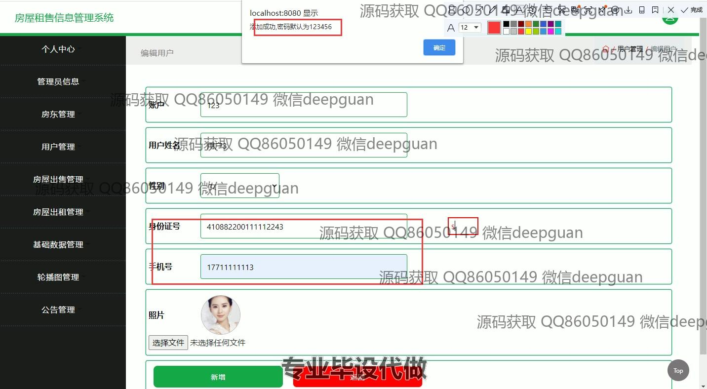
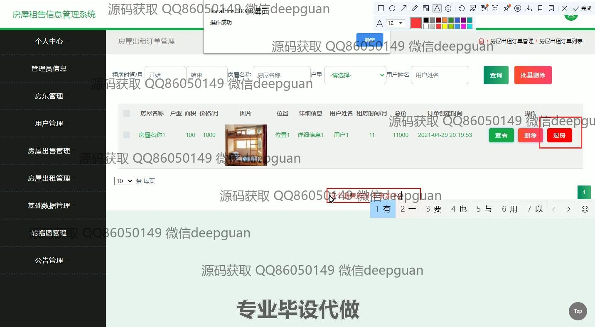
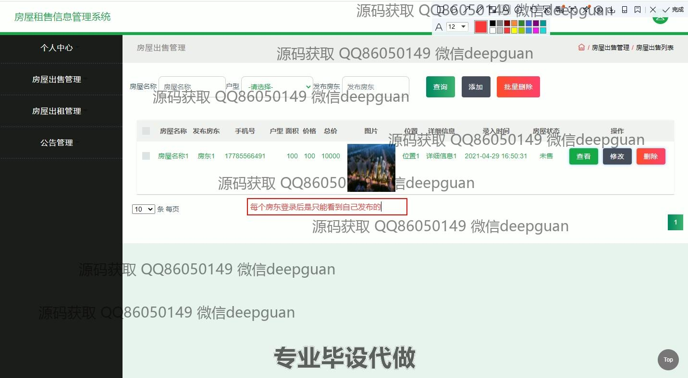
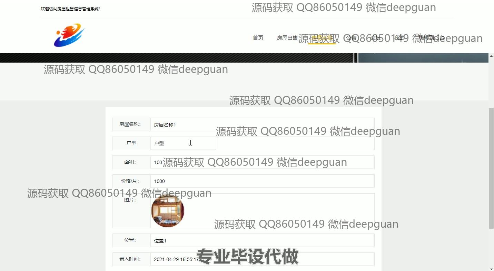

<h1 align="center">房屋租售信息管理系统</h1>

## 简介
房屋租售信息管理系统：角色分为管理员、房东和用户；功能包括用户管理、房源出售与出租管理、论坛互动、公告与轮播图管理等，支持查询与订单管理，界面简洁友好，方便房产信息综合管理。    --计算机毕业设计源码；毕设源码；java毕业设计源码

## 联系方式

<h3 align="center">获取完整代码与数据库文件 + 微信：deepguan QQ: 86050149 QQ群: 783742310</h3>

<h3 align="center">可帮忙远程部署 包运行成功！提供远程部署、修改代码、设计文档指导、代码讲解等服务！</h3>

## 功能介绍（完整见运行截图）
管理员：基本功能包括登录、注册和退出，能管理系统基础数据、用户信息、房东信息、房屋出售及出租信息，操作轮播图和公告模块，支持添加、修改、删除及批量操作等功能，便于对系统进行全局管理。

房东：可以发布和管理自己的房源信息，包括房屋名称、户型、面积、价格、位置等，支持上传房屋图片并查看、修改和删除已发布的信息，同时可查询订单详情和管理租赁周期。

用户：支持注册、登录、查看和修改个人信息，能够通过系统浏览房屋出售和出租信息，进行搜索、筛选、留言互动，还可以查看和管理自己的房屋订单。

游客：无需登录即可访问系统首页，浏览房屋信息和公告内容，使用基本的房屋搜索功能，通过论坛参与简单互动，获取基础的房产信息展示。

## 运行截图

本代码来源于网络,仅供学习参考使用!

